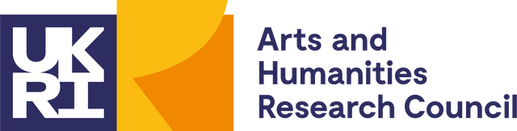

<!-- README.md is generated from README.Rmd. Please edit that file -->

```{r, include = FALSE}
knitr::opts_chunk$set(
  collapse = TRUE,
  comment = "#>"
)
```

<!-- badges: start -->

[{width="84"}](https://www.ox.ac.uk/) [{width="83"}](https://www.ling-phil.ox.ac.uk/) [{width="325"}](https://www.ukri.org/councils/ahrc/) </br>*This work is part of the [AHRC-funded project](https://app.dimensions.ai/details/grant/grant.12915105) on the lexical resources for Enggano, led by the Faculty of Linguistics, Philology and Phonetics at the University of Oxford, UK. Visit the [central webpage of the Enggano project](https://enggano.ling-phil.ox.ac.uk/)*.

<p xmlns:cc="http://creativecommons.org/ns#">

This work is licensed under <a href="https://creativecommons.org/licenses/by-nc/4.0/?ref=chooser-v1" target="_blank" rel="license noopener noreferrer" style="display:inline-block;">Creative Commons Attribution-NonCommercial 4.0 International </a>

</p>

[](https://www.repostatus.org/#wip)

<!-- badges: end -->

## Overview

The current work in this repository is XML-tagging the relevant words (with their respective languages and German gloss) in the unstructured OCR output. The tagging is used to processed the OCR into a [tibble/table](https://github.com/complexico/vrosenberg1878/blob/main/data/vrosenberg1878.tsv) (also work-in-progress). The comparative word list in von Rosenberg [-@vonrosenberg1878] includes words from the Enggano language and they are included in the Shiny app of the [*EnoLEX*](https://enggano.shinyapps.io/enolex/) database [@krausse_enolex_2024; @rajeg_enolex_2024].

## References
